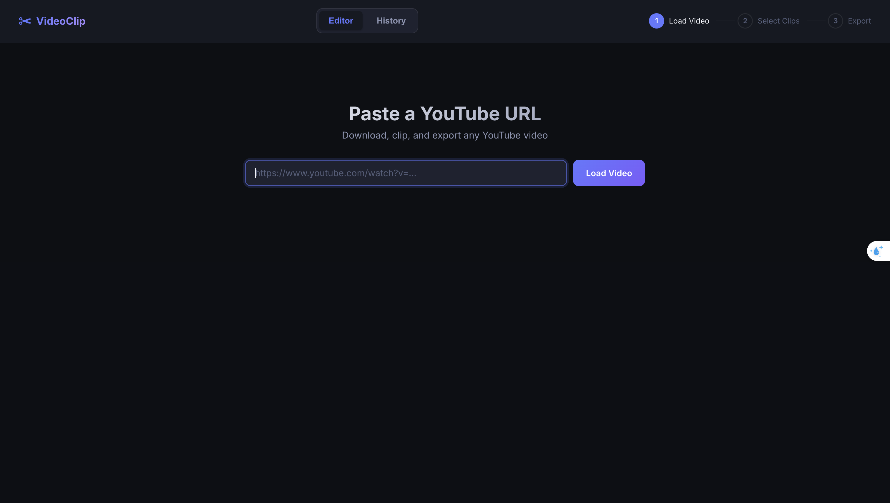
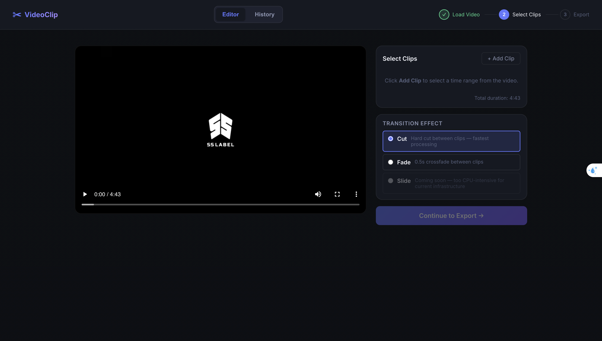
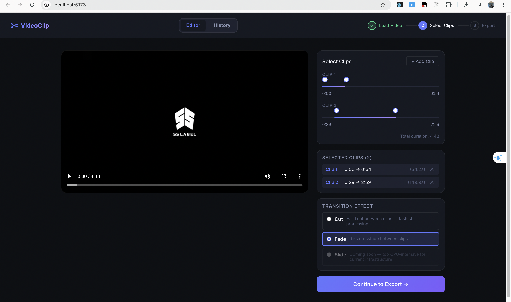
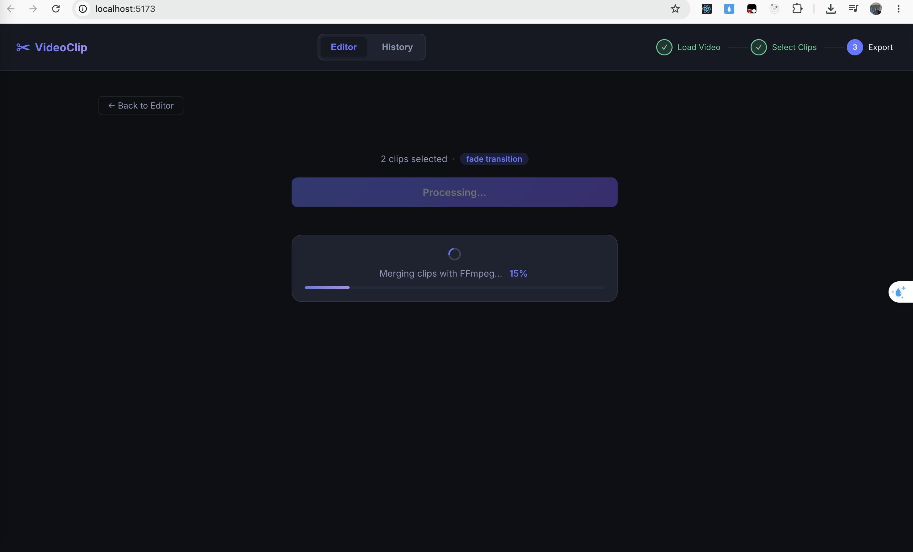
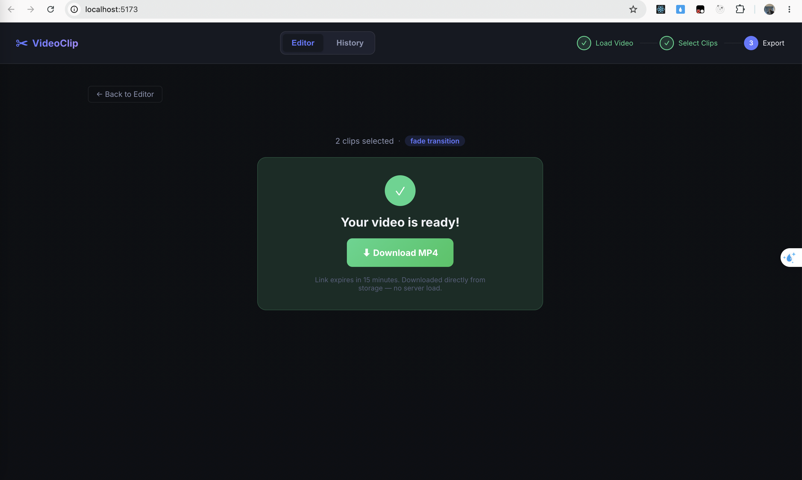
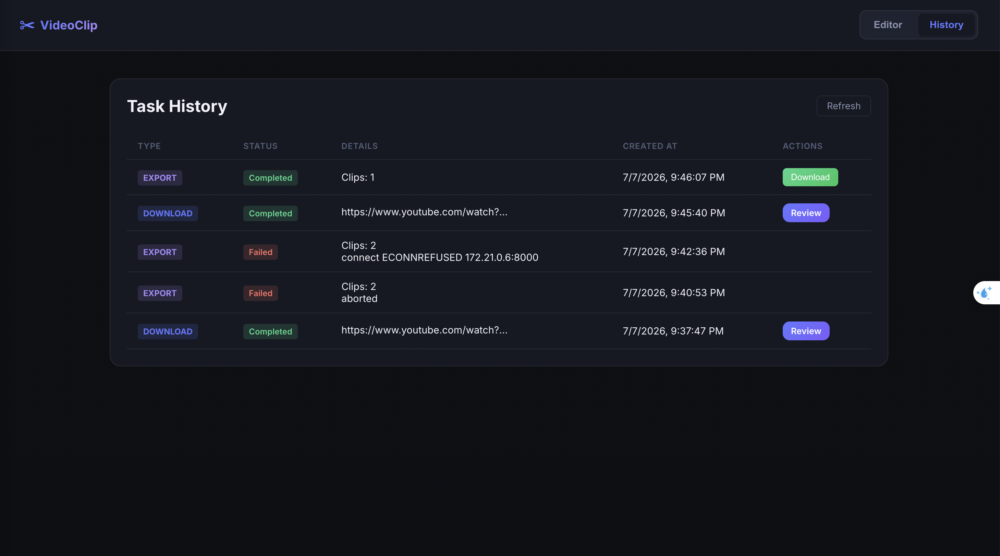

# Video Editor Mini App

A web-based video editing prototype for internal content creators. Paste a YouTube URL, select clip time ranges, apply transitions, and download a merged `.mp4` — no command line required.

---

## Quick Start

```bash
cd docker && docker compose up --build
```

Open [http://localhost:5173](http://localhost:5173)

MinIO console (inspect files): [http://localhost:9001](http://localhost:9001) — login: `minioadmin / minioadmin`
 
 docker compose down && docker compose up -d --build
---

## Architecture

```
┌─────────────┐     ┌───────────────┐     ┌──────────────────────┐
│  Frontend   │     │   NestJS API  │     │   Python Worker      │
│ React/Vite  │────▶│    :3000      │────▶│   FastAPI :8000      │
│   :5173     │     │ BullMQ jobs   │     │ FFmpeg + yt-dlp      │
└─────────────┘     └──────┬────────┘     └──────────┬───────────┘
                            │                          │
                  ┌─────────▼──────────┐              │
                  │   Redis :6379      │              │
                  │  job queues        │              │
                  │  + metadata hashes │              │
                  └────────────────────┘              │
                                                       │
                  ┌────────────────────────────────────▼──────┐
                  │   MinIO :9000  (S3-compatible)            │
                  │   source/{videoId}/{videoId}.mp4          │
                  │   exports/{exportId}/output.mp4           │
                  └───────────────────────────────────────────┘
```

---

## Stack & Design Decisions

## Break down: 

| Path | Purpose |
|---|---|
| [spec.md](/.agent/tasks/spec.md) | Full specification (6 core areas) |
| [plan.md](/.agent/tasks/plan.md) | Technical plan with phase details |
| [todo.md](/.agent/tasks/todo.md) | Ordered task checklist |

### 👉 [Read the full Design Decisions & Evaluation Write-up](DESIGN_DECISIONS.md) 👈

The above document contains detailed answers to the evaluation questions, including:
- **System Design & Tradeoffs**: Why we chose microservices, MinIO, and no relational database.
- **Resource Management**: How the system survives the 0.5 vCPU / 1GB RAM constraint.
- **Code Quality**: Architecture, typing, and isolation.
- **Product Sense**: UX decisions like SSE and optimistic UI.
- **Engineering Judgment**: Why we didn't build a complex timeline or use WebSockets.
- **Open Question — Scaling**: How the system behaves under 1,000 concurrent users and the step-by-step plan to fix it.

---

## Showcase Demo

Here is a visual walkthrough of the Video Editor Mini App in action:

**1. Loading a Video**


**2. Video Editor Interface**


**3. Selecting Clips & Transitions**


**4. Exporting the Result**


**5. Completed Export**


**6. Task History Tracker**

